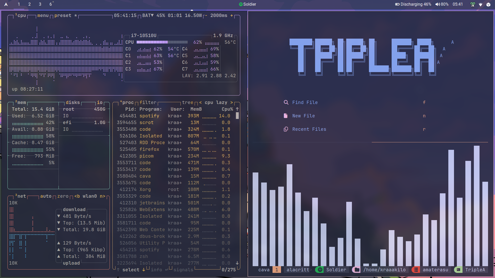

# Dotfiles

This repository contains my personal configuration files (dotfiles) for various applications and tools on my Arch Linux setup. These files help maintain a consistent environment across different machines.

## Content

- **Alacritty**: Custom terminal configuration.
- **Dunst**: Notification daemon settings.
- **GTK**: Theme and appearance that i use.
- **i3**: Window manager configuration and scripts that make my workflow easier.
- **Picom**: Compositor settings for transparency and effects.
- **Polybar**: My minimalistic status bar configuration.
- **Rofi**: Application launcher and window switcher.
- **Tmux**: Terminal multiplexer settings.
- **Zsh**: Shell configuration. I use zsh with oh-my-zsh and some plugins.
- **wal**: Pywal configuration for color schemes based on wallpaper.
- **sxhkd**: Hotkey daemon settings.
- **Scripts**: Various scripts that i use for different tasks.

## Installation

To install these dotfiles, clone the repository and run the `bootstrap.sh` script:

1. Clone the repository:
   ```sh
   git clone https://github.com/kraaakilo/dotfiles.git
   ```
2. Navigate to the dotfiles directory:
   ```sh
   cd dotfiles
   ```
3. Make the `bootstrap.sh` script executable:
   ```sh
   chmod +x bootstrap.sh
   ```
4. Run the script:
   ```sh
    ./bootstrap.sh
    ```

## Screenshot
    - [](misc/shot.png)